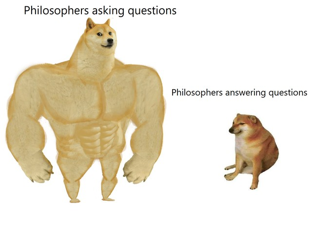

Equanimity. A word I can neither spell nor pronounce correctly – yet I epitomize it for many people. I define it as being content. It means that you have a calm and even mind no matter what going on around you. I have that. My base state is slightly happy(lets say, +0.3). Something really good happens, I get slightly more happy – (think +0.5). Something bad happens, its goes a bit down – but not really sad(-0.2). I can never go to the extremes – neither the euphoria(+1) nor the depression(-1). Because of this, all my friends think that I don’t have emotions(as evidenced by my use of numbers to quantify emotions). Well, they are wrong. I have emotions – just muted ones.

It has some disadvantages(its very difficult for me to be extremely happy), but the advantages are well worth it...

- You never get depressed due to external circumstances.
- You are functional in situations that are very stressful.
- You have a state of good mental health.
- You are a lot more in control of your emotions - even other emotions like anger, jealousy or any of the other popular ones.
- Etc - because I'm too lazy to think of more

Turns out, this concept is very popular in Philosophy. Many philosophies consider this as their main goal. And I have figured it out by myself.

As a mater of fact, this is how I got into this field. When I got to know that I have reached the goal of many philosophies by myself, I thought "I'm a natural philosopher - I should do that in real life". But that would mean that I'll lose a lot of my coolness quotient. Because most philosophers are **boring old men with really big beards**. The only way to balance that is to attach it to attach it to something considered cool - in this case, I selected stand-up. That way the coolness I lost with philosophy will be made up by the coolness brought in by stand-up - there by reaching a state of thermal equilibrium. And yes, I'm working on that beard.

## Equanimity in major philosophies

Many philosophies use different terms to talk about Equanimity...

### Ataraxias

This is a greek word(because greek philosophy tend to use greek words). It can be translated as Tranquility - freedom from distress and worry. Multiple greek philosophies use this term...

- Stoicism
- Epicureanism
- Pyrrhonism

But all three define Ataraxia in slightly different ways, because, [philosophy](https://www.reddit.com/r/PhilosophyMemes/comments/hrpbu9/my_boi_wittgenstein/). Epicureanism and Pyrrhonism think of Ataraxia as the ultimate goal of life. 

### Apatheia

Another Greek word. It's literal translation means "without suffering/without passion". The English word 'Apathy' comes from this word - but it has a very different meaning from Apatheia. Mostly because [English is a stupid language](http://blog.binnyva.com/2009/05/useless-skills-ability-to-spell-part-1-english/).

### Eudaimonia

This is one of the big ones - many philosophies think of this as the goal of life. It can be translated as human flourishing or prosperity. Many prominent Greek Philosophers have used this concept...
- Socrates
- Plato
- Aristotle (Thus hitting the Greek philosopher trifecta)
- And others

### Upeksha

Source: Indian Philosophy, Buddhism
In Indian Philosophies, it means: Non-attachment, even-mindedness or letting go. 
In Buddhism it means: staying neutral in the face of the eight worldly conditions... 
- Loss / Gain
- Good-repute / Ill-repute
- Praise / Criticism
- Sorrow / Happiness

### Samatvam

This is from Hindu Philosophy - specifically from Gita. In that book Krishnan says, and I paraphrase, "Arjun, bro. Perform your duty as well as you can without any attachment to success or failure." 

### Other Phrases that people use to mean Equanimity

... but originally means something else.

- Zen
- Nirvana

## Practical Equanimity

Now that I have demonstrated how important the concept of equanimity is, lets get to the next question - how be in that state. Each philosophy has an answer - which boils down to "Do what this philosophy tells you to do". If you want to follow 20 different philosophies, go ahead, do that. If not, I have a condensed version of the plan - made by copy-pasting from a bunch of ancient philosophies.

Before you start, a word of warning. Just because you know it doesn't mean that you can live it. Most philosophies expects you to reach this state only after years or even decades of self work. To show this clearly, I'll attach a difficultly rating to each solution.

### Ataraxia

If you believe that something is good or bad, its a problem. When you DON'T get the "good thing", you are upset. And if by any chance you get the "bad thing", again, upset. You chase the good and avoid the bad.

On the other hand, if you take no position as to what is good or bad, you neither avoid nor pursue intensely. Result, Ataraxia. 

Difficulty Rating: 3/5 (5 being most difficult).

### Apatheia

Don't react emotionally or egotistically to external events, the things that are outside your control. For stoics, practically everything is outside their control - except your own actions and thoughts.

Difficulty Rating: 4/5. Best of luck hitting this one.

### Eudaimonia

According to Aristotle, you can get this by living a good/virtuous life.

Difficulty Rating: 5/5. I'm not even going to try this.

### Upeksha

You can reach this by getting free of all kinds of desires. Then there will be no preference for one thing over the other. Buddhism goes into some detail regarding this...

- Have neither pleasure nor displeasure
- Mind is equally affected towards all beings
- Mind is equally affected towards all thoughts
- Mind is equally affected by the same force of determination
- Mind is equally affected towards all kinds of wisdom.
- Mind is sensible to neither pleasure nor pain
- And a few more that are more confusing - so I'm skipping those.

Difficulty Rating: 3/5. Because its very close to Ataraxia, and I had already rated it a 3.

### Samatva

Do your duty well, don't worry about the outcome too much. Winning and failing is beyond your control - so don't have an attachment to neither.

Difficulty Rating: 1/5. Fairly easy - just be super lazy. Eating will become a problem soon(because you don't have money for food) - but that is beyond the scope of this article. 

## Conclusion

As you can see, reaching Equanimity is fairly difficult. To be specific, according to my very scientific and not at all biased system, it has a 16/25 difficulty rating. 

Its really difficult because we are using the tools given by philosophy to get there. Ideally, Philosophy is good at asking questions. It gets really confused when it comes to answers.

To find a better answer to this, we have a better tool: Psychology. But I'll save that for [the next article](https://standup-philosophy.netlify.app/05-psychological-equanimity/).